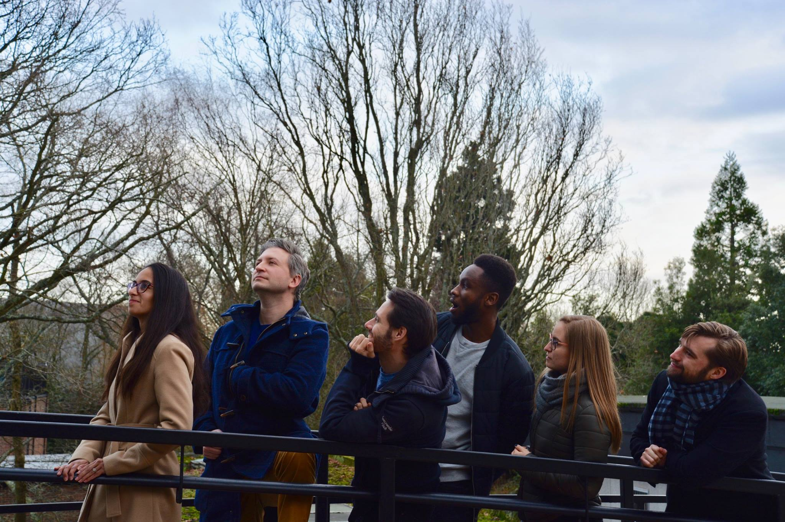

```{r, echo=F}
# https://rstudio.github.io/leaflet/map_widget.html
# https://rpubs.com/mattdray/basic-leaflet-maps
suppressMessages(library(eyeTrackR))
suppressMessages(library(kableExtra))
suppressMessages(library(leaflet))
suppressMessages(library(leafsync))
suppressMessages(library(twitterwidget))
suppressMessages(library(formattable))
```

# Welcome to Search Lab {#index}

[***This site is a work in progress. Be please gentle while we finish building it.***]{.ul}

Welcome to the Search Lab website. This website has been put together as a way of gathering all of our lab-based resources. Here you'll find materials for experiments, code, analysis scripts, and datasets. In addition, you'll also find a sketchpad of links and snippets that we find useful in supporting our research efforts.

I've always wanted to put together something that has the format of a kind-of wiki website that is useful as a resource for referring to when needed, and for training others who join the team. That's what this website is for. Hopefully you'll find it useful, too.

Oh, and I should probably introduce myself as well. My name is Hayward Godwin, and I'm currently an Associate Professor at the University of Southampton in the UK. Broadly speaking, my primary research interest is in how people search for things, which is why this is called Search Lab. The type of search, and what things are being looked for, can vary. It can include objects on a computer screen, perhaps involving an interest in what someone's eyes do when searching. It can also involve searching the environment for objects hidden in a house, for people lost in the wilderness, and many others besides. Regardless of the nature of the targets being searched for, how the search is being conducted, or the situation that they are being searched in, all of these tasks are unified by search of some kind.

## Meet the Team

The team listed here isn't necessarily one group of people who work for one person at one place. We're scattered all around and have different loosely-defined roles and different levels of involvement in the different projects that take place. That is by no means unusual since it seems to be the way that most labs and most long-term clusters of collaborations work out.

Since we are quite far apart now, it's difficult to get us together all at once, but below are some attempts at group photos!

### 2020-2021

No photo this year either just yet, but hopefully we might get something by the end of the year.

### 2019-2020

This was, of course, a difficult and unusual year. Sadly we didn't manage to get a group photo.

### 2018-2019



## Collaborators, Near and Far

I've been fornuate to work with, and learn from, a whole bunch of different people over the years. I thought it might be fun to visualise just some of the people I've worked with the most on some maps below. Click on each pin for more information!

```{r echo=F}


# TODO: 
# Hayward to add Irina to Bucharest, Romania
# Hayward to add Sarah to Cardiff
# Also+ 1

#http://leaflet-extras.github.io/leaflet-providers/preview/
# https://rstudio.github.io/leaflet/popups.html
# https://r-spatial.github.io/mapview/articles/articles/mapview_04-popups.html#interactive-popups
# https://rstudio-pubs-static.s3.amazonaws.com/359811_ef55c6bd08ce40a8b82b57274a96bbb0.html#43_marker_points

m = leaflet(options = leafletOptions(zoomControl = FALSE,
                                 minZoom = 5, maxZoom = 5,
                                 dragging = FALSE)) %>% 
  setView(lat = 54.1238715577, lng=-2.86563164084,  zoom = 5) %>% addTiles() %>%  
  #addProviderTiles("Stamen.Terrain") %>%
  #addProviderTiles(providers$Esri.WorldTopoMap) %>%
  addProviderTiles(providers$Esri.WorldImagery) %>%
  #addProviderTiles("NASAGIBS.ViirsEarthAtNight2012") %>%
  addCircleMarkers(color='white', stroke = FALSE, fillOpacity = 1, radius=6,
    lat = 50.9346, lng = -1.3960,
    popup = "<b>University of Southampton</b><br>Hayward Godwin (all sorts)<br>Andreea Butnaru (search, eyeTrackR)<br>Charlotte Lee, Sara Miledge (reading, eyeTrackR)<br>Phillipa Broadbent (Pain Lab, eyeTrackR)",
    label = 'Southampton',
    labelOptions = labelOptions(noHide = T, textOnly = T,style = list("color" = "white"), 
                                direction='right',offset = c(7, -1))
    #label = "University of Southampton",
    #labelOptions = labelOptions(noHide = T, textOnly = F,direction = "right")
    ) %>%
  addCircleMarkers(color='white', stroke = FALSE, fillOpacity = 1, radius=6,
    lat = 50.7432, 
    lng = -1.8969, 
    popup = "<b>Bournemouth University</b><br>Natalie Mestry (search, real-world search)",
    label = 'Bournemouth',
    labelOptions = labelOptions(noHide = T, textOnly = T,style = list("color" = "white"), 
                                direction='left',offset = c(-8, 1))
    #labelOptions = labelOptions(noHide = T, textOnly = F,direction = "left")
    ) %>%
  addCircleMarkers(color='white', stroke = FALSE, fillOpacity = 1, radius=6,
    lat = 53.400002, 
    lng = -2.983333, 
    popup = '<b>Liverpool Hope University</b><br>Nick Donnelly (search, real-world search, fashion advice)',
    label= 'Liverpool',
    labelOptions = labelOptions(noHide = T, textOnly = T,style = list("color" = "white"), 
                                direction='left',offset = c(-8, 1))
    #labelOptions = labelOptions(noHide = T, textOnly = F,direction = "left")
    ) %>%
  addCircleMarkers(color='white', stroke = FALSE, fillOpacity = 1, radius=6,
    lat = 53.763021, 
    lng = -2.7074, 
    popup = '<b>University of Central Lancashire</b><br>Simon Liversedge (search, real-world search, reading)',
    label = 'Wigan',
    labelOptions = labelOptions(noHide = T, textOnly = T,style = list("color" = "white"), 
                                direction='left',offset = c(-8, 1))
    #labelOptions = labelOptions(noHide = T, textOnly = F,direction = "right")
    ) %>%
  addCircleMarkers(color='white', stroke = FALSE, fillOpacity = 1, radius=6,
    lat = 52.20167 , 
    lng = 0.11779, 
    popup = '<b>University of Cambridge</b><br>Alex Muhl-Richardson (search, real-world search, eyeTrackR)',
    label = 'Cambridge',
    labelOptions = labelOptions(noHide = T, textOnly = T,style = list("color" = "white"), 
                                direction='left',offset = c(-8, 1))
    #labelOptions = labelOptions(noHide = T, textOnly = F,direction = "right")
    )  %>%
  addCircleMarkers(color='white', stroke = FALSE, fillOpacity = 1, radius=6,
    lat = 54.966667, 
    lng=	-1.600000, 
    popup = '<b>Newcastle University</b><br>Nick Holliman (search, 3D visualisations)',
    label = 'Newcastle',
    labelOptions = labelOptions(noHide = T, textOnly = T,style = list("color" = "white"), 
                                direction='left',offset = c(-8, 1))
    #labelOptions = labelOptions(noHide = T, textOnly = F,direction = "right")
    ) 
 
m2 = leaflet(options = leafletOptions(zoomControl = FALSE,
                                 minZoom = 3.5, maxZoom = 3.5,
                                 dragging = FALSE)) %>% 
  setView(lat = 40.283 , lng=-100.748,  zoom = 3.5) %>% addTiles() %>%
  #addProviderTiles("Stamen.Terrain") %>%
  addProviderTiles(providers$Esri.WorldImagery) %>%
  addCircleMarkers(color='white', stroke = FALSE, fillOpacity = 1, radius=6,
             lat = 32.283, lng = -106.748, 
             label = 'Las Cruces',
             popup = 'x <br/> New Mexico State University',
             labelOptions = labelOptions(noHide = T, textOnly = T,style = list("color" = "white"), 
                                direction='left',offset = c(-8, 1))) %>%
  addCircleMarkers(color='white', stroke = FALSE, fillOpacity = 1, radius=6,
             lat = 42.340382, lng= -72.496819, 
             label = 'Massachusetts',
             popup = 'University of Massachusetts Amherst',
             labelOptions = labelOptions(noHide = T, textOnly = T,style = list("color" = "white"), 
                                direction='left',offset = c(-8, 1))) %>%
  addCircleMarkers(color='white', stroke = FALSE, fillOpacity = 1, radius=6,
             lat = 33.424564, lng=	-111.928001, 
             popup = 'Arizona State University',
             label='Tempe',
             labelOptions = labelOptions(noHide = T, textOnly = T,style = list("color" = "white"), 
                                direction='left',offset = c(-8, 1))) %>%
  addCircleMarkers(color='white', stroke = FALSE, fillOpacity = 1, radius=6,
             lat = 42.588081, lng=	-87.822899, 
             popup = 'Carthage College', 
             label = 'Kenosha',
             labelOptions = labelOptions(noHide = T, textOnly = T,style = list("color" = "white"), 
                                direction='left',offset = c(-8, 1)))

leafsync::latticeview(m, m2, ncol=1)

```
